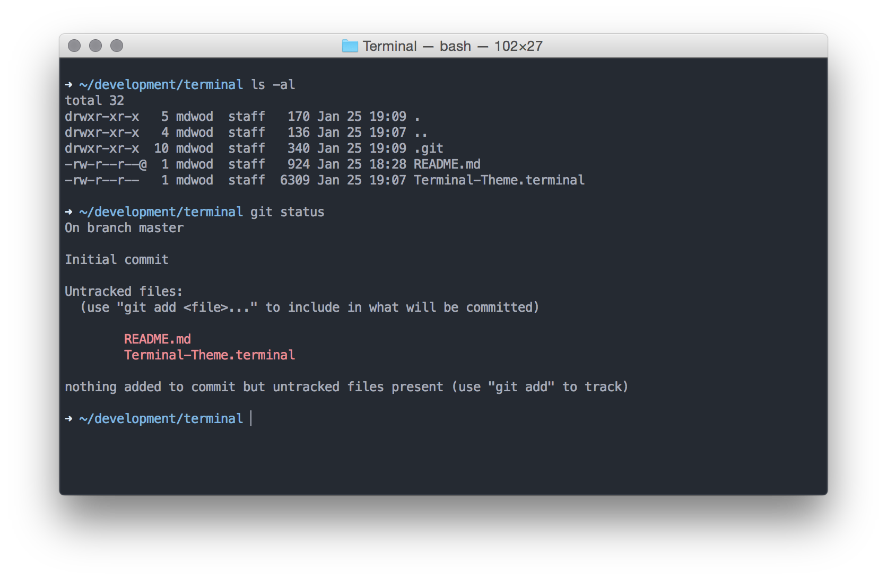

# Terminal Theme

This is the Terminal.app theme that I use on a OS X machine. It is based on the [Base16 Ocean Theme](http://chriskempson.github.io/base16/#ocean) and a bit more customised from me.

## Usage

1. Download the Terminal.app theme.
2. Open the Terminal.app **Preferences** (#,) and then **Profiles**.
3. Now **Import...** the downloaded theme (**Import** is hidden in settings, next to + and -).
4. Set as default by selecting the new profile and clicking the **Default** button.

## Terminal Prompt

The Terminal Prompt is from [Mark Otto](https://github.com/mdo/config). I modified it and added it to the bash configuration that I use – You can check it out, change and use it as you want.

## License

This build is based on the free available [Base16 Ocean Theme](http://chriskempson.github.io/base16/#ocean) and is licensed MIT.